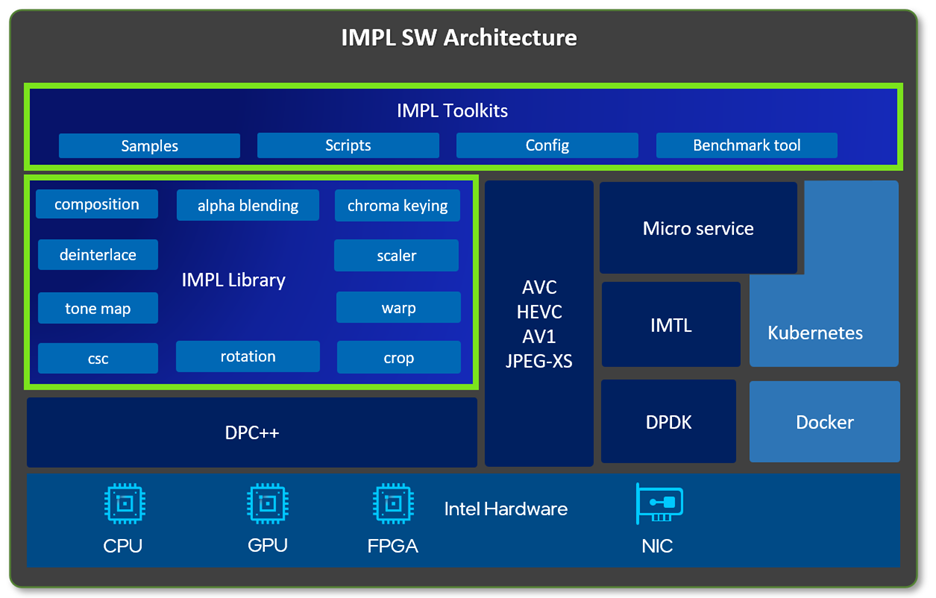

# Intel Media Processing Function Library
## 1.Overview
Intel® Media Processing Library(IMPL) optimized media processing functions based on Intel platforms, the media processing functions include Color Space Conversion(CSC), resize, composition, Alpha blending and so on. IMPL is a oneAPI DPC++ based software library designed for providing optimized video processing filters using Intel CPU/GPU/FPGA-accelerator, DPC++ APIs are based on familiar standards-C++ STL, Parallel STL (PSTL), Boost.Compute, and SYCL*, more details about DPC++ please refer to [DPC++](https://www.intel.com/content/www/us/en/developer/tools/oneapi/dpc-library.html?wapkw=dpc%2B%2B#gs.zjkgc3). With video processing functions, a complex pipeline can be set up flexibly. Besides, many industrial video formats are supported, which provides diversity for video production use cases. Moreover, based on cross-industry DPC++ language, IMPL library could easily offload video processing tasks to GPU, CPU or FPGA, which brings great convenience in customers use cases.
Here is the IMPL software architecture. IMPL library is the core to provide the multiple video processing functions. On the top of architecture is IMPL toolkits. In toolkits, there are samples developed from IMPL library. Configs and Scripts help to deploy the IMPL library conveniently. With benchmark tool, sample performance can be easily got. At the bottom, there are intel hardwares. Besides, there are more functions can be combined with IMPL. For example, codec and micro service may be part of IMPL pipeline to support multiple media workflow. IMPL library can also process the online video received from Intel Media Transport Library(IMTL). IMPL pipeline can be put in the container with docker technology. It can be seen that IMPL has many usage scenarios.

## 2.Features
IMPL supports some multiple video processing filters to improve the video processing performance, such as optimized CSC, resize, rotation, composition and Alpha blending. CSC supports video format conversion. Alpha blending filter enables the transparency of one video, and then composite it with another video. IMPL will also support other features mentioned in the IMPL software architecture afterwards. These features could be combined together to set up complex pipeline flexibly according to customer's requirements.
Please refer to [feature guide](doc/feature.md) for supported features in detail.

## 3.Build
Please refer to [build guide](doc/build.md) for how to build IMPL library.

## 4.Run
Please refer to [run guide](doc/run.md) for how to run IMPL sample application.

## 5.API
Please refer to [API guide](doc/api-guide.md) for how to use IMPL library to build pipelines.
