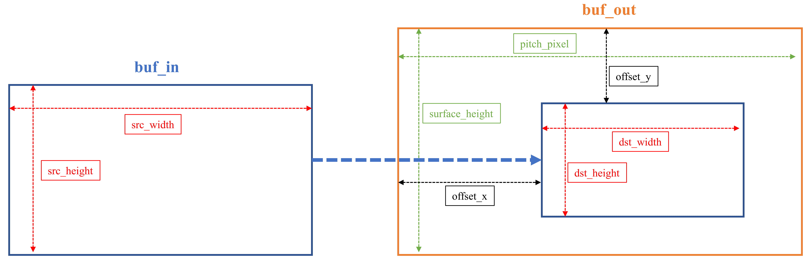

# IMPL APIs usage guide
## 1. Basic running of IMPL filter
IMPL was developed by DPC++, which is based on SYCL. Related terms can be found in the [SYCL Specification](https://registry.khronos.org/SYCL/). IMPL encapsulates DPC++ functions. Using IMPL in your project requires **no** DPC++ header files and is compatible with C code.

The basic running of IMPL filter has the following 5 steps:
- Create queue
- Allocate memory
- Filter context setup and initialization
- Run filter
- Release resources

### 1.1 Create queue
Use the following API to create a queue and get a pointer to the queue. The API will select the load device CPU or GPU, and configure enable_profiling.
```cpp
void* pq = impl_common_init(bool is_target_cpu, bool enable_profiling);
```
### 1.2 Allocate memory
Allocate CPU and GPU memory.
### 1.3 Filter context setup and initialization
Set the parameters of the filter context and initialize it, during which the event memory will be allocated, and the parameters of the internal operation will be set.
### 1.4 Run filter
The main part of the program, including copying memory, running filters, synchronization, and other operations.
### 1.5 Release resources
Free CPU and GPU memory, event memory, filter context and queue.

## 2. IMPL Memory
IMPL memory is based on [Unified Shared Memory (USM)](https://registry.khronos.org/SYCL/specs/sycl-2020/html/sycl-2020.html#sec:usm).
### 2.1 Memory Allocate and free
Two APIs can be used to allocate memory.
```cpp
    unsigned char* ptr =  impl_image_mem_alloc(void *pq, impl_video_format format, int width, int height, impl_mem_type type, size_t *allocated_size);
    void*          ptr =  impl_common_mem_alloc(void *pq, int ebytes, int num_element, impl_mem_type type);
```
impl_image_mem_alloc is specifically designed to allocate memory for images. The variable pointed to by allocated_size is the return value, saving the size of the allocated memory (in bytes). allocated_size can be NULL.impl_common_mem_alloc is used to allocate general memory.
To free memory use the following API:
```cpp
    impl_common_mem_free(void *pq, void *buf);
```
### 2.2 Memory type
There are three types of memory types: host, device and shared.

Host memory is the memory allocated in the CPU, which can be directly accessed by C/C++ code, such as the fread function, but the IMPL kernel cannot be accessed.

Device memory is the memory allocated in the device (most GPUs). The IMPL kernel can access it, but the host code cannot. It should be noted that when the device is a CPU, the C/C++ code on the host cannot access device memory.

Shared memory can be accessed by both host code and IMPL kernel. But it may cause implicit memory copy between CPU and GPU, reducing performance.

The input and output of filter must be device or shared memory, and device memory is recommended.
### 2.3 Memory copy
Use the following API for memory copy between host and device.
```cpp
    impl_common_mem_copy(void *pq, void *evt, void *dst, void *src, int size, void *dep_evt, bool is_sync);
```
evt is the return value, pointing to the returned event of memory copy, and it can be NULL. dep_evt is the event that memory copy depends on, it can be NULL. 

## 3. IMPL filter context setup guide
Currently IMPL includes three filters csc, resize and mixer(composition and alphablending), and their usage steps are basically similar, all filters include init, run and unint 3 steps, while different API parameters are set for different filters.
Take resize as an example here.
Declare variables
```cpp
    struct impl_resize_params resize_params;
    void *prs_context;
```
Manually set an initial value of 0 to resize_params.
```cpp
    memset(&resize_params, 0, sizeof(resize_params));
```
Configure resize_params and call the init function. Allocate memory to the evt member to save the event returned by each submitting task. How to configure each filter will be described below.
```cpp
    resize_params.pq         = pq;
    resize_params.format     = resize_format;
    resize_params.src_width  = src_width;
    resize_params.src_height = src_height;
    resize_params.dst_width  = dst_width;
    resize_params.dst_height = dst_height;
    ret                      = impl_resize_init(&resize_params, prs_context);
```
Call the run function to run the filter. dep_evt points to the dependent event, and this task will not be run until dep_evt is completed. Set to NULL when there is no dependency.
```cpp
    ret = impl_resize_run(&resize_params, prs_context, buf_in, buf_out, NULL);
```
Free resize_params and context.
```cpp
    ret = impl_resize_uninit(&resize_params, prs_context);
```
### 3.1 CSC
The structure to save CSC parameters is impl_csc_params, including queue, event, is_async, input video format, output video format, input video width and height. The sample for CSC filter is written in samples/csc.cpp. For csc.cpp, input video format and output video format need to set in the command line, others of impl_csc_params can use the default value in csc.cpp.

### 3.2 resize
The five parameters that must be set in resize_params are pq, format src_width, src_height, dst_width and dst_height, and the rest can use default values. resize supports offset output feature for flexible usage, it needs to configure offset_x, offset_y, pitch_pixel and surface_height. The figure below shows the member variables, and the unit is pixel.
<div align="center">

</div>

### 3.3 mixer
The structure to save composition and alphablending parameters is impl_mixer_params, including queue, layers, is_async, video format and an array named field. In composition and alphablending, each video that needs to be combined has a field. The array field records all the video fields. The max quantity of field array is 20, which means IMPL library supports to combine up to 20 videos. Each field is described in the impl_mixer_field_params struture, including event, one field video data buffer, field index, the width&height of field, offset&crop coordinates, alpha value type and is_alphab. In impl_mixer_field_params struture, offset parameter(offset_x, offset_y) configures the location where the video is combined. Besides, IMPL library supports to crop the source video before composition or alphablending, crop parameter(crop_x, crop_y, crop_w, crop_h) indicates the frame location and size of the cropped video. The figure below shows these parameters, and the unit is pixel.  
<div align="center">

</div>
The parameter is_alphab indicates the field is whether for composition or alphablending. IMPL supports two alpha value types for alphablending, one is static alpha value, the other is alpha_surf which supports to save the non-static alpha value in a .bin file. In all fields, field[0] is the video that has the max screen size, other videos are overlaid on top of the largest video. The samples for composition and alphablending filter are written in samples/alphablending.cpp and samples/composition.cpp.

## 4. IMPL Event
Submitting a task for execution returns an event object. In IMPL,  memory copy and filter running can get event. Event can be used to control task order(dependent event), synchronization, and get task profiling.
Use the following API to allocate memory for the returned event for impl_common_mem_copy.
```cpp
    void* evt = impl_common_new_event();
```
Use the following API to free event memory
```cpp
    void impl_common_free_event(void *evt);
```
Events in filter context are allocated by filter context init function and freed by uninit function.
Executing the following API will block the program until the evt is completed.
```cpp
    void impl_common_event_sync(void *evt)
```
Executing the following API will wait for all tasks in the queue to complete.
```cpp
    void impl_common_queue_sync(void *pq);
```
The following API will get the running time of a task. It should be noted that the task must have been completed, and enable_profiling=true when the queue was created
```cpp
    double time = impl_common_event_profiling(void *evt);
```

