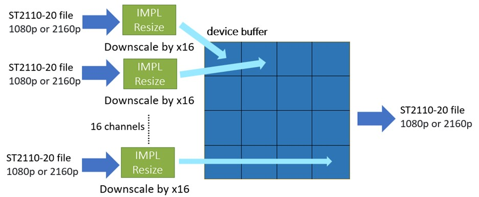
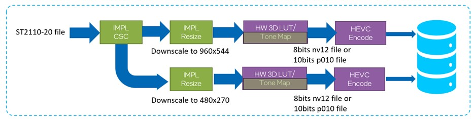
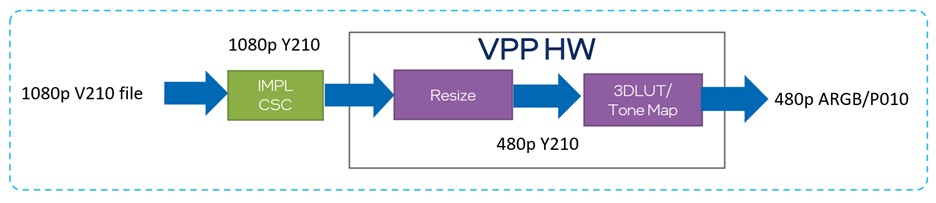

Running on Ubuntu 22.04
# Run Guide
## 1 Run the sample feature
The following contents give an example about how to run sample features. Pls note before running the IMPL features, input yuv files need to be prepared.
### 1.1 Color space conversion
#### 1.1.1 Convert v210 to yuv422ycbcr10be(ST2110-20)
Below is the command to convert v210 file to yuv422ycbcr10be format(ST2110-20 supported format for 422 10bit BE)
```shell
./csc -size 1920X1080 -frame 1 -in_format v210 -out_format yuv422ycbcr10be -i xxx_v210.yuv
```
The yuv422ycbcr10be file can be viewed by YUV Viewer tools(https://github.com/IENT/YUView).

### 1.2 Resize
#### 1.2.1 yuv422ycbcr10be(ST2110-20) resize
Below is the command to resize yuv422ycbcr10be file from 1920X1080 to 3840X2160.
```shell
./resize -in_size 1920X1080 -out_size 3840X2160 -frame 1 -in_format yuv422ycbcr10be -interp_mtd bilinear -i xxx_yuv422ycbcr10be.yuv
```

### 1.3 Composition
#### 1.3.1 i420 composition
Below is the command to compose two i420 files together.
```shell
./composition -in_format i420 -frame 1 -size 1920X1080 -compsize 640X360 -offset 0X0 -compfile xxx_foreground_i420.yuv -i xxx_background_i420.yuv
```

### 1.4 Alphablending
#### 1.4.1 i420 alphablending
Below is the command to alpha blend two i420 files together. IMPL supports static surface and alpha surface. Static surface means transparency value of all pixels is same, static value can be set by static_alpha. For alpha surface, each pixel has a different transparency value stored in a .bin file. transparency value is ranging from 0 to 255.
```shell
./alphablending -in_format i420 -frame 1 -static_alpha 128 -size 1920X1080 -compsize 640X360 -offset 0X0 -compfile xxx_foreground_i420.yuv -i xxx_background_i420.yuv
./alphablending -in_format i420 -frame 1 -alphafile xxx_alpha.bin -size 1920X1080 -compsize 640X360 -offset 0X0 -compfile xxx_foreground_i420.yuv -i xxx_background_i420.yuv
```

### 1.5 Command line help usage
Suppose there are some questions about how to use these features(csc/resize/composition/alphablending), --help command can print the usage of these features.
Below is the command to show the help usage.
```shell
./csc --help
./resize --help
./composition --help
./alphablending --help
```

## 2 Set up pipeline
IMPL provides the basic features, a complex pipeline can be set up with these basic features flexibly.
Hardware memory copy is used for frame data CPU to GPU and GPU to CPU by API impl_common_mem_copy(). It always shows better performance than normal memcpy by CPU with C or CPP language since Intel hardware Blitter copy engine is used.
A frame data pre-read method is supported for the pipeline samples controlled by option -pre_read. It is used for excluding performance impact caused by slow reading input frame data from files, and it's disabled by default.
And option -profile is used to control if enabling GPU profile. If enabling GPU profile, slight additional GPU compute resource is needed to collect GPU profiling statistics data, so it's disabled by default to get better performance.
IMPL displays three pipeline samples, including multi viewer pipeline, replay pipeline and convert pipeline.
### 2.1 Multi viewer pipeline
Multi viewer pipeline has subxy * subxy 1080p or 2160p inputs(ST2110-20 format, now our code only supports 1 file for input and the remaining files are copied from input file) and 1 1080p or 2160p stream output(ST2110-20 format). At present, IMPL only supports subxy is set to 2/3/4. The whole pipeline process is as follows, it takes subxy=4 as an example, which means the 16 videos are all scaled down to a quarter of their original size in both the x and y directions, thus 16 videos are resized to 1/16 of the original size overall.

<div align="center">

</div>

Below are the commands of multi viewer pipeline.
```shell
./multiview -frame 30 -size 3840X2160 -subxy 4 -i xxx_yuv422ycbcr10be_2160p.yuv
./multiview -frame 30 -size 1920X1080 -subxy 4 -i xxx_yuv422ycbcr10be_1080p.yuv
```
Multi viewer supports synchronous and asynchronous mode controlled by option -sync sync_mode, sync_mode=1 is synchronous mode and sync_mode=0(default) is asynchronous mode, synchronous means IMPL filter always waiting it to be finished after called impl_xxx_run() function, while asynchronous mode make IMPL filters working on parallel by building dependency between the former and next IMPL filters with events, so that asynchronous mode always can get better performance.

### 2.2 Replay pipeline
Replay pipeline has 1 2160p stream ST2110-20 format input and 2 encoded HEVC outputs. 1 input file is converted to p010 format, and it's resized to two different sizes(p010 format, 960x544, 480x270). With 1 3DLUT file prepared by customer, two scaled files will be processed with 3DLUT filter. In 3DLUT module, original p010 format can be converted to nv12 format, thus 3dlut output could be p010 or nv12 format. Then two files are encoded after 3DLUT.
<div align="center">

</div>

Below are the commands of replay pipeline. -3dlut specifies the 3dlut file prepared by customer, -is_p010 specifies the video format which is going to be encoded, -is_p010 1 means the video format is p010. If there is no -is_p010 or -is_p010 0, video is nv12 format.

```shell
./replay -frame 20 -3dlut 3dtable_file.bin -is_p010 1 -i xxx_yuv422ycbcr10be_2160p.yuv
./replay -frame 20 -3dlut 3dtable_file.bin -i xxx_yuv422ycbcr10be_2160p.yuv
```

Replay also supports synchronous and asynchronous mode controlled by option -sync sync_mode as Multi viewer, while the asynchronous mode does not show very big performance gain than synchronous mode as Multi viewer, the reason is that IMPL filters run very fast and the VPP HW is the bottle neck in the whole pipeline.
BTW, before running replay pipeline, pls set “export LIBVA_DRIVERS_PATH=/usr/lib/x86_64-linux-gnu/dri/”, libva does not work without it and may cause "total black output” for 3dlut.

### 2.3 Convert pipeline
Convert pipeline has 1 1080p stream v210 format input and 1 YUV output(ARGB or p010 format). The input v210 video is converted to y210 video by IMPL CSC, and the y210 video is resized to 480p in VPP HW, then it's processed by 3DLUT or Tone Mapping filter in VPP HW with output ARGB or p010 video.
<div align="center">

</div>
Below are the commands of convert pipeline. -is_p010 1 means the video format is p010. If there is no -is_p010 or -is_p010 0, video is ARGB format. -is2call indicates the VPP HW is called twice for better performance but worse quality.

```shell
./convert -frame 60 -3dlut 3dtable_file.bin -i xxx_v210_1080p.yuv -is2call -o out.yuv
./convert -frame 60 -3dlut 3dtable_file.bin -i xxx_v210_1080p.yuv -is_p010 -is2call -o out.yuv
```

Convert does not support asynchronous mode for asynchronous mode has almost no performance impact and the VPP HW is the bottle neck in the whole pipeline.
What's more, a GPU memory sharing method is used between IMPL CSC output buffer and VPP HW input surface. The VPP HW linear input surface is created, and the input surface pointer is generated and used directly as IMPL CSC output buffer pointer by binding DPC++ queue and oneVPL/MFX session. This method does not need memory copy from IPML CSC to VPP HW at all and it improves performance a lot.
